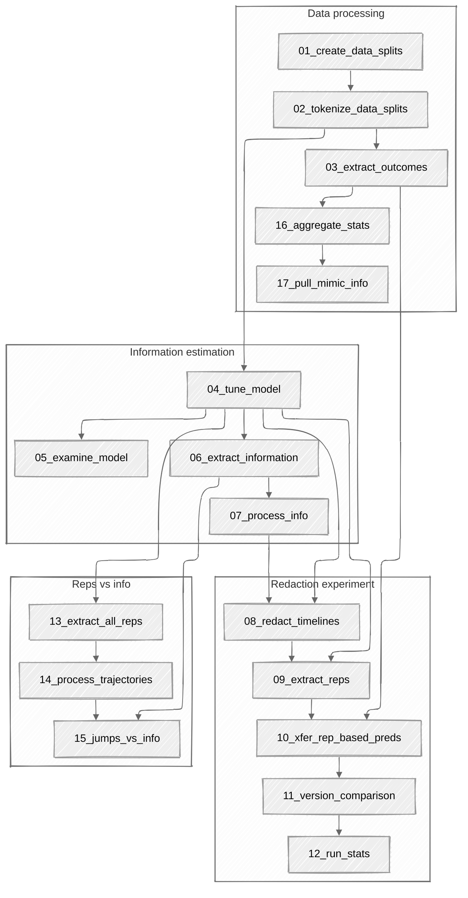

# Quantifying surprise in clinical care: Detecting highly informative events in electronic health records with foundation models

> We present a foundation model-derived method to identify highly informative
> tokens and events in electronic health records. Our approach considers incoming
> data in the entire context of a patient's hospitalization and so can flag
> anomalous events that rule-based approaches would consider within a normal
> range. We demonstrate that the events our model flags are significant for
> predicting downstream patient outcomes and that a fraction of events identified
> as carrying little information can safely be dropped. Additionally, we show how
> informativeness can help interpret the predictions of prognostic models trained
> on foundation model-derived representations.

**This code reproduces the results found in our paper[^1].**

## Requirements & structure

The bash scripts can be run in a [slurm](https://slurm.schedmd.com) environment
with the specified resource requirements. (We used compute nodes with 8×A100
40GB-PCIe GPUs, connected with 2×16-core 3.0-GHz AMD Milan processors for
GPU-based work.) Each bash script calls one or more python scripts that depend on
an environment as described in the `requirements.txt` file. You can set up an
environment with [pytorch](https://pytorch.org/get-started/locally/) configured
for CUDA 12.8 with [uv](https://docs.astral.sh/uv/pip/) as follows:

```sh
uv venv --python=$(which python3) venv
. venv/bin/activate
uv pip install --torch-backend=cu128 --link-mode=copy -e .
```

For plots to render correctly, you may need to install a working version of
[tex](https://www.tug.org/texlive/) on your system. The code is structured
logically as follows, where the numerical prefixes correspond to the prefixes in
the slurm files (located in the [slurm folder](./slurm)):



## What the code does

### Data processing (and tokenization)

We consider 422k hospitalization events for adults (age 18 or older) from the
Beth Israel Deaconess Medical Center between 2008–2019
([MIMIC-IV-3.1](https://physionet.org/content/mimiciv/3.1/)) and 50k
hospitalization events from [UCMC](https://www.uchicagomedicine.org) between
March 2020 and March 2022. We restricted to patients with stays of at least 24
hours. We formatted EHR data from each health system into the
[CLIF-2.0.0 format](https://web.archive.org/web/20250711203935/https://clif-consortium.github.io/website/data-dictionary/data-dictionary-2.0.0.html).
The MIMIC patients were partitioned intro training, validation, and test sets at
a 70\%-10\%-20\% rate, according to the randomized time of their first
hospitalization event, with training patients coming first, followed by
validation and then test. We then collected each hospitalization event for
patients in a given set. In this way, hospitalization records in the test set
corresponded to patients with no hospitalization events in the training or
validation sets. UCMC data was primarily used as a held-out test set. For this
reason, we partitioned UCMC hospitalizations into training, validation, and test
sets at a 5\%-5\%-90\% rate in the same manner as used for MIMIC.

We convert each hospitalization event into a sequence of integers corresponding
to the stay. For a given sequence, the first token always corresponds to timeline
start token. The next three tokens contain patient-level demographic information
on race, ethnicity, and sex. The following two tokens correspond to
admission-specific information, namely patient age converted to a decile and
admission type. Taken together, we refer to the 5 tokens occurring immediately
after the timelines start token as the _admission prefix_. Tokens corresponding
to a variety of events for a hospitalization are then inserted in the same order
in which these events occurred. Transfers are encoded with their CLIF location
category. Labs are encoded with two tokens and inserted at the time results
become available: one for the lab category, and a second corresponding to the
deciled lab value in the training data within that category. We call this
strategy, of tokenizing categories and binning their corresponding values
according to the training value of the deciles, category-value tokenization:


A handful of other tables receive this type of tokenization: vitals and results
according to vital category, medication and dosage by medication category,
assessment and results by assessment category. Respiratory information is
recorded at the beginning of respiratory support; the encoded information is mode
category and device category. We include a token indicating if a patient is
placed into a prone position. All hospitalization-related data is encoded this
way and inserted in chronological order. Tokens that arrive synchronously
correspond to an event and always appear coterminously in a sequence. Timelines
then end with a token for discharge category and a dedicated timeline end token.

### Information estimation

Consider the set $V^T$ of length $T$ sequences of tokens drawn from some
vocabulary $V$. For a given sequence $x=(x_1,\dotsc, x_T)$ and indices
$1\leq u \leq v \leq T$, we let $x_{u:v}=(x_u, x_{u+1}, \dotsc, x_v)$ correspond
to the subsequence and $x_{<u}=x_{1:u-1}$ to the context at $u$ for $u>1$. If $p$
is a probability distribution on $V^T$, we let
$p(x_{u:v})=P_{X\sim p}(X_{u:v}=x_{u:v})$ denote the marginal distribution and
$p(x_{u:v}|x_{y:z})=P_{X\sim p}(X_{u:v}=x_{u:v}|X_{y:z}=x_{y:z})$ denote the
conditional for indices $u,v,y,z$. We adopt the convention that
$p(x_{u:v} | x_{<1}) = p(x_{u:v})$. In this work, we focus on the context-aware
information given by

$\boxed{I_p(x_t | x_{<t}) = - \log_{2} p(x_t | x_{<t})}$

for tokens $x_t$ and by

$\boxed{I_p(x_{u:v} | x_{<u}) = - \log_{2} p(x_{u:v} | x_{<u})}$

for subsequences $x_{u:v}$. As
$p(x_{u:v} | x_{<t})=\textstyle\prod\nolimits_{t=u}^v p(x_t | x_{<t})$, it
follows that
$I_{p}(x_{u:v} | x_{<u})=\textstyle\sum\nolimits_{t=u}^v I_{p}(x_t | x_{<t})$.
Thus, the context-aware information for subsequences can be obtained by adding
over that of the individual tokens. In our case, we focus on subsequences of
tokens that are added to our timelines contemporaneously. We call these "events."

We train a foundation model (FM) from scratch using a variation of the Llama-3.2
1B-parameter architecture on our tokenized MIMIC training and validation sets.
This model then takes the place of $p$ in the above equations. We can take
example timelines and use the model-determined measure of information to
highlight them (first 102 tokens shown here, reading from left to right in
row-major order):


### Redaction experiment

We drop events (corresponding to subsequences $x_{u:v}$) according to their
model-determined informativeness $I_{p}(x_{u:v} | x_{<u})$. For details, please
see our manuscript.

### Representations vs. information

We relate movements in model-derived representation space to the informativeness
of the corresponding tokens or events. Again, further details are available in
the manuscript.

## Usage notes

-   Credentialed users may obtain the
    [MIMIC-IV-3.1 dataset](https://physionet.org/content/mimiciv/3.1/) from
    Physionet. [This repo](https://github.com/bbj-lab/CLIF-MIMIC) contains
    instructions and code for converting it to the
    [CLIF-2.0.0 format](https://web.archive.org/web/20250711203935/https://clif-consortium.github.io/website/data-dictionary/data-dictionary-2.0.0.html).
    (Use the [v0.1.0](https://github.com/bbj-lab/CLIF-MIMIC/releases/tag/v0.1.0)
    release.) The `rclif-2.0` folder location is then passed as `--data_dir_in`
    to the [first slurm script](./slurm/01_create_data_splits.sh).

-   Many of the slurm scripts assume a folder structure as follows, where
    `tree ${hm}` (_cf_
    [tree](https://manpages.ubuntu.com/manpages/noble/man1/tree.1.html)) looks
    something like this:

    ```sh
    .
    ├── data-mimic # MIMIC datasets
    │   ├── raw
    │   │   ├── test
    │   │   │   ├── clif_adt.parquet
    │   │   │   ├── ...
    │   │   │   └── clif_vitals.parquet
    │   │   ├── train
    │   │   │   ├── clif_adt.parquet
    │   │   │   ├── ...
    │   │   │   └── clif_vitals.parquet
    │   │   └── val
    │   │       ├── clif_adt.parquet
    │   │       ├── ...
    │   │       └── clif_vitals.parquet
    │   ├── ...
    │   └── W++_first_24h-tokenized
    │       ├── test
    │       │   └── tokens_timelines.parquet
    │       ├── train
    │       │   ├── tokens_timelines.parquet
    │       │   └── vocab.gzip
    │       └── val
    │           └── tokens_timelines.parquet
    ├── data-ucmc  # UCMC datasets
    │   └── ...
    ├── mdls  # to hold all models generated
    │   └── ...
    ├── mdls-archive  # models for long-term storage
    │   └── llama-med-60358922_1-hp-W++
    │       ├── config.json
    │       ├── generation_config.json
    │       └── model.safetensors
    ├── Quantifying-Surprise-EHRs  # THIS REPO
    │   └── ...
    └── figs  # for generated figures
    ```

    Tokenized datasets are deposited into the `data-mimic` or `data-ucmc` folder,
    depending on data provenance. Trained models are stored in `mdls`. Many
    models are generated and these take up significant amounts of space. Models
    to be kept are copied into `mdls-archive`. Generated figures are placed in
    the `figs` folder.

-   Slurm jobs can be queued in sequence as follows:

    ```sh
    j01=$(sbatch --parsable 01_create_train_val_test_split.sh)
    j02=$(sbatch --parsable --depend=afterok:${j01} 02_tokenize_train_val_test_split.sh)
    j03=$(sbatch --parsable --depend=afterok:${j02} 03_extract_outcomes.sh)
    ...
    ```

-   If you find yourself manually running python scripts from an interactive
    slurm job afer running `preamble.sh`, you can append:

    ```sh
    2>&1 | tee -a output/$SLURM_JOBID-$jname.stdout
    ```

    to keep logs.

[^1]:
    M. Burkhart, B. Ramadan, L. Solo, W. Parker, & B. Beaulieu-Jones,
    [Quantifying surprise in clinical care: Detecting highly informative events in electronic health records with foundation models](https://doi.org/10.1142/9789819824755_0013),
    Pacific Symposium on Biocomputing 31 (2026), 173—188.
